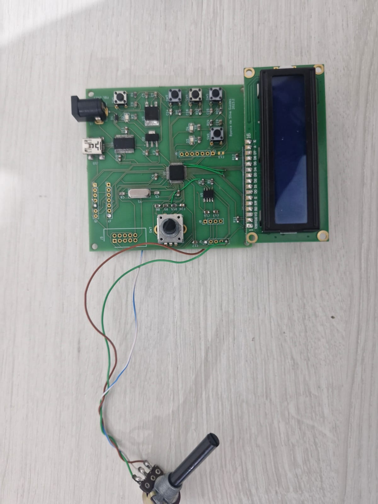
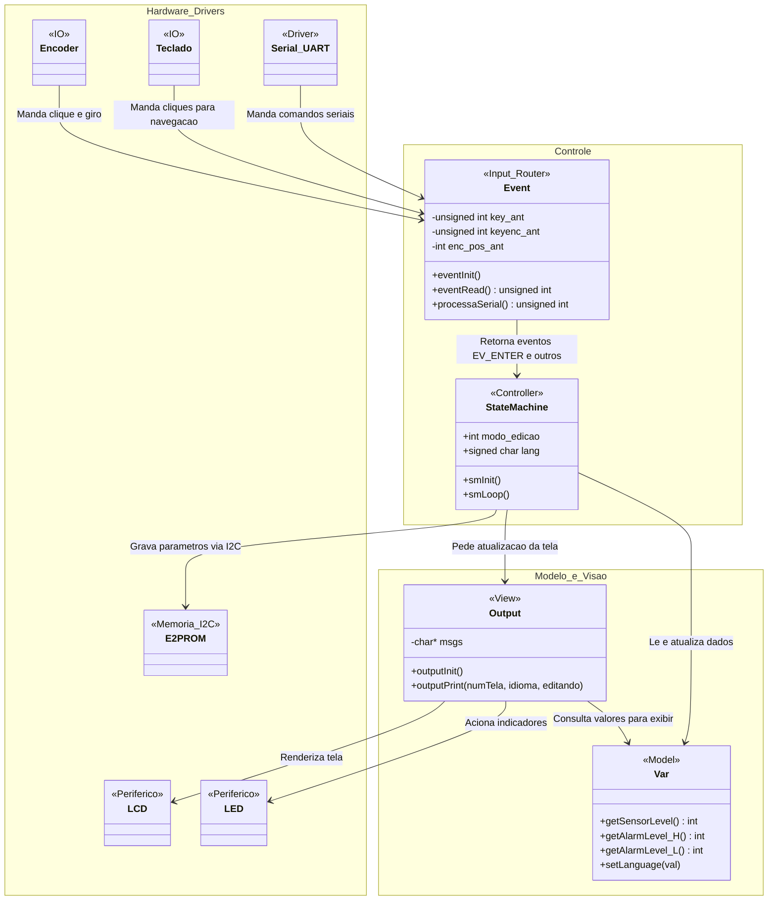
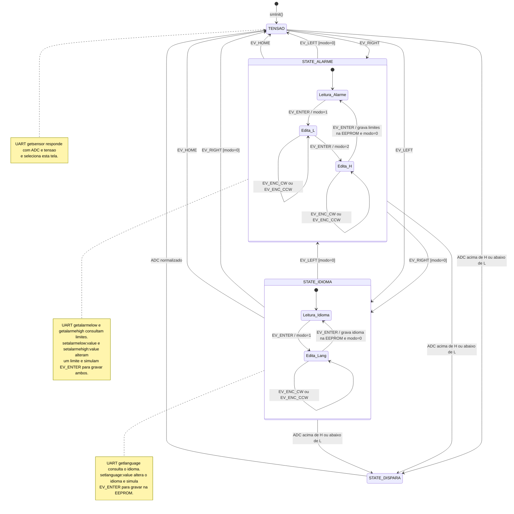
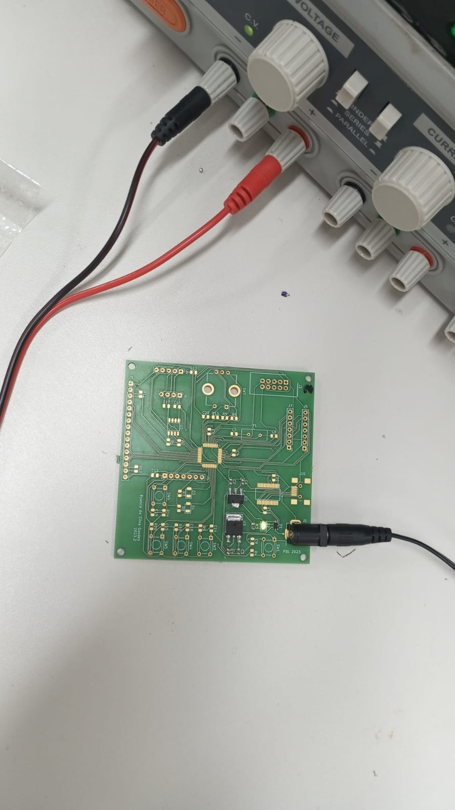
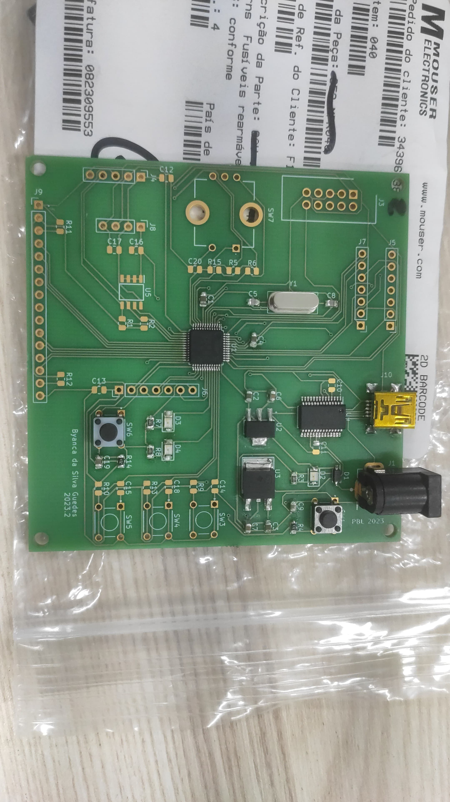

# Smart Sensor Monitoring & Alarm System (LPC11U14)



> **Academic Note:** This project was developed as part of the **PBLE02 - Board Bring Up and Electronic Prototype Validation** course, instructed by Professor [Rodrigo Maximiano](@rmaalmeida). The course provided a hands-on "from scratch" engineering experience: we received a bare PCB and loose components, requiring us to manually solder the board, perform physical hardware validation, and troubleshoot electrical issues before developing the firmware. The software utilizes base hardware abstraction libraries provided by [Osmar Bruno] (@BRun0442) [Anunciador de Alarmes] (https://github.com/BRun0442/Anunciador-de-alarmes).
## 🎥 Video Demonstration

[](images/demo.mp4)

[▶ Watch the demonstration video (MP4, 1:37, no audio)](images/demo.mp4)

The video shows the completed board, LCD interface, physical controls, and serial communication with a PC.

---

## 📐 Architecture & UML

**Note:** The UML diagrams below are symbolic representations of the firmware modules and control flow. This project is written in C and does not use object-oriented classes or inheritance.

The project is structured into logical layers (Strict MVC) to guarantee maintainability and data shielding:

1. **Hardware Abstraction Layer (HAL):** `I2C.c`, `e2prom.c`, `Teclado.c`, and `Serial.c` interact directly with the LPC11U14 silicon registers.
2. **Event Router (Input Manager):** `event.c` centralizes and processes both physical clicks and Serial port strings.
3. **Controller (State Machine):** `stateMachine.c` evaluates events, executes business logic, and orchestrates EEPROM cycles.
4. **Model & View:** `var.c` acts as the Model, safely storing runtime data, while `output.c` acts as the View, consuming this data to render the LCD and drive the LEDs.

### Class Diagram



### State Machine



The nested editing nodes represent the `modo_edicao` flag, not separate values in the state enum. `TENSAO` represents `STATE_TENSAO`; `STATE_FIM` is an enum sentinel. The UART notes show the commands handled by `event.c`; a SET command saves to EEPROM only when the alarm check lets the simulated ENTER event run. In the current implementation, an alarm does not clear `modo_edicao`; press HOME after the reading returns to normal if editing was interrupted. `getlanguage` does not yet include a French reply.

---

## 🛠️ Hardware Setup

* **Microcontroller:** NXP LPC11U14 (ARM Cortex-M0)
* **External Memory:** 24LC512 EEPROM (I2C Address `0x50`)
* **Human-Machine Interface:** LCD Display, Rotary Encoder, and Push Buttons
* **Communication:** UART Interface (Serial via PC)

### Assembly Stages

1. **Power supply test:** The PCB connected to a bench supply before the microcontroller and user interface were installed. The lit LED shows this early electrical check.

   

2. **Intermediate assembly:** The microcontroller and part of the supporting circuitry are mounted, while the display and remaining controls are still absent.

   

3. **Completed prototype:** The LCD, push buttons, encoder, and other components are mounted on the board.

   

### Circuit Diagram

The circuit schematic can be added here when it is available.

---

## 🚀 Key Features

* **Resilient State Machine:** Menu navigation and parameter editing managed by a central State Machine, with automatic UI lockout during alarms.
* **Anti-Lockup I2C Driver:** Custom driver supporting timeouts and emergency bus release. Tolerant to physical connection failures.
* **Data Persistence (EEPROM):** Communicates with a 24LC512 chip to store alarm thresholds and language preferences. Includes silicon burn-time compensation (10ms).
* **Hybrid Interface (HMI & Serial):** Operable physically (Encoder/Buttons/LCD) or remotely (UART).
* **Mathematical Auto-Snapping:** Fine-tuning the alarm thresholds via the encoder snaps to multiples of 5 using modulo arithmetic.

---

## 💻 Serial Interface Commands

The system supports remote operation via a Serial terminal (e.g., PuTTY, Tera Term). Commands are case-insensitive.

**GET Commands (Read):**
* `getalarmelow` - Returns the current minimum voltage threshold.
* `getalarmehigh` - Returns the current maximum voltage threshold.
* `getsensor` - Returns the current ADC value and the converted voltage.
* `getlanguage` - Returns the current system language (Portuguese, English, French).

**SET Commands (Write & Physical Save):**
* `setalarmelow:[value]` - Sets a new minimum threshold, updates UI, and writes to EEPROM. (e.g., `setalarmelow:105`)
* `setalarmehigh:[value]` - Sets a new maximum threshold and saves it to EEPROM.
* `setlanguage:[0, 1 or 2]` - Changes global display language and saves to non-volatile memory.

---

## ⚙️ Build and Run

1. Clone this repository:
   ```bash
   git clone [https://github.com/SEU_USUARIO/LPC11U14-Smart-Monitor.git](https://github.com/SEU_USUARIO/LPC11U14-Smart-Monitor.git)
